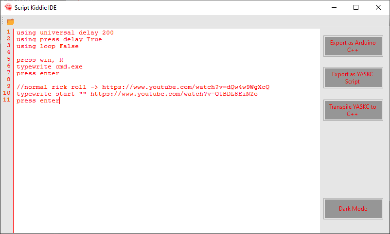

# Script Kiddie IDE

This is an IDE for YASKC (you're a script kiddie cope) programming language. It transpiles to Arduino C++ to run on an Estick (rubber ducky like pen testing device).

# VERY IMPORTANT
We are not responsible for any trouble you get into you get into for using estick, yaskc, or any related applications. Anything you do with this is _**on you**_ not us. We are not lawyers, this is not a legal statement. 

## Syntax
Right now we're kinda cringe so theres only a couple things you need to know about in order to **do a little trolling**.
### Using Keyword 
use the "using" keyword to set options
> using universal delay 200

the above line sets delay in between commands to 200 milliseconds(ms)
> using press delay

sets delay for keyboard presses
> using loop false

this sets the loop option to false. As expected, it prevents the script from looping over and over again
### Typewrite Keyword
use the "typewrite" keyword to get the estick to type something onto the screen
> typewrite troll

this types "troll" into whatever window you have in focus.
Use this in combination with the **press** keyword to chain events and cause a little mischeif
### Press Keyword
This just presses keys.
"press" <--- Use that 
> press Win, R

The above presses windows key and r at same time.
Key Table:
**Key Table coming soon**
## Conclusion
That wasn't so hard was it? I hope you learned something and go out to do a little trolling
